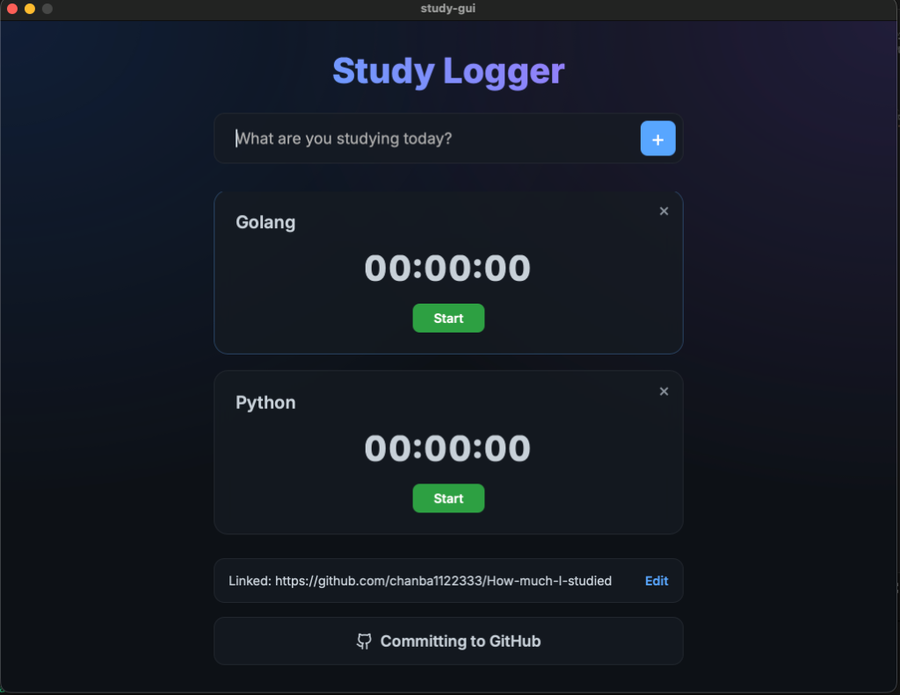

# 📚 Study Tracker GUI

A beautiful, modern, cross-platform desktop application built with [Wails](https://wails.io/) and Go. Track your daily study or work sessions and automatically push the aggregated time logs to your GitHub repository to keep your commit graph (grass) growing! 🌱

<br>
<p align="center">
  
</p>
<br>

## ✨ Features
- **Cross-Platform:** Runs seamlessly on both **Mac** and **Windows**.
- **Modern UI:** Designed with a vibrant dark-mode aesthetic, smooth micro-animations, and glassmorphism elements.
- **Accurate Timer:** Tracks each task down to the exact second. Need to pause? Easy. Made a mistake? Just delete the task.
- **One-Click GitHub Sync:** Connect your personal repository once, and commit all your paused/running tracking times immediately.
- **Smart Formatting:** Less than a minute? We track the seconds. Over an hour? We omit the seconds for a clean summary (e.g., `Go: 1 hours 30 minutes, Baekjoon: 45 minutes`).

## 🚀 Getting Started

### 1. Prerequisites
- **[Go](https://go.dev/dl/)** (version 1.18 or higher)
- **[Wails CLI](https://wails.io/docs/gettingstarted/installation)** 
  ```bash
  go install github.com/wailsapp/wails/v2/cmd/wails@latest
  ```

### 2. Installation
Clone this repository to your local machine:
```bash
git clone https://github.com/YOUR_USERNAME/study-gui.git
cd study-gui
```

### 3. Run in Development Mode
To test the app locally with hot-reloading:
```bash
wails dev
```

### 4. Build for Production
To build the native desktop application (.app for Mac, .exe for Windows):
```bash
wails build
```
You will find the executable in the `build/bin` directory.

## 📖 How to Use
1. **Link your Repo:** At the bottom right corner, click **Edit** under "GitHub linking". Paste the URL of the repository where you want to store your study logs (e.g., `https://github.com/User/My-Study-Logs.git`) and click **Link**.
2. **Add a Task:** Type the subject you are studying in the input box and press `+`.
3. **Start Studying:** Click the green **Start** button on the task card to start the timer.
4. **Pause or Finish:** Click **Pause** to stop tracking temporarily. If you are entirely done with the session, scroll to the bottom.
5. **Commit:** Click the **Committing to GitHub** button. The app will automatically calculate your time, format a beautiful commit message, create a Markdown history entry in your linked repo, and `git push` it entirely in the background.

## 🤝 Contributing
Contributions, issues, and feature requests are welcome! Feel free to check the [issues page](../../issues).

## 📝 License
This project is [MIT](https://choosealicense.com/licenses/mit/) licensed.
